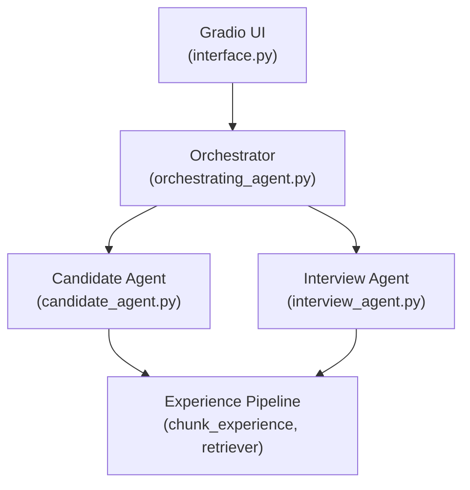

# RoleCraft AI (CRAFTAI)

An adaptive AI interview platform with two personas: **Candidate** (answers interview questions on your behalf) and **Interviewer** (conducts a mock interview and scores your responses). Built with Gradio, multi-provider LLM support, and a generate–evaluate–retry loop to reduce hallucination and generic answers.

## Overview

Users onboard via the sidebar with:
- Name
- LinkedIn profile / resume (PDF or text)
- Experience summary (text file — chunked and structured at ingest)
- Job description

They then choose a persona. A single orchestrator routes messages to the appropriate agent after validating required inputs and API usage limits.

## Architecture


Flow

- User submits profile, experience, and job description in the sidebar.
- Orchestrator validates inputs and routes by persona.
- Candidate: generate → evaluate → retry if rejected.
- Interviewer: ask up to 3 questions → evaluate full session at the end.
- Experience is chunked at ingest and retrieved by topic when needed.

### Key modules

| Module | Role |
|--------|------|
| `interface.py` | Gradio Blocks UI, persona selection, chat |
| `orchestrating_agent.py` | Entry point, validation, routing |
| `candidate_agent.py` | Grounded answer generation with self-critique |
| `interview_agent.py` | Adaptive questioning and end-of-session scoring |
| `chunk_experience.py` | LLM-based experience structuring at ingest |
| `experience_retriever.py` | Topic-based chunk retrieval (tool-ready) |
| `dataprocessing_helper.py` | PDF/text ingest, chunking, state population |
| `get_llm_model.py` | Multi-provider model routing |

## Design choices

### 1. Experience chunking at onboarding

Raw experience text is not passed directly into prompts. On submit, `chunk_experience()` uses an LLM with a strict JSON schema (`ExperienceChunks`) to produce:

- **`chunks`**: Topic-based bullets (metrics, tools, outcomes preserved verbatim)
- **`topic_map`**: Maps interview topic phrases → relevant chunk keys

This improves outcomes by:
- Removing filler and narrative noise before the agent sees the data
- Preserving exact metrics and tool names (anti-hallucination anchor)
- Enabling targeted retrieval per question (via `get_chunks_for_topic`)

Chunks are saved to `docs/{name}/experience_chunks.json` for reuse.

### 2. Dual-model strategy

| Task | Default model | Rationale |
|------|---------------|-----------|
| Chat / generation | `gemini` (gemini-2.5-flash) | Strong conversational generation |
| Evaluation / parsing | `groq` (gpt-oss-120b) | Structured critique and JSON parsing |

Separating generator and evaluator reduces self-approval bias: the model that writes the answer is not the same one that judges it.

### 3. Candidate: generate → evaluate → retry loop

Flow in `candidate_agent_chat()`:

1. **`run()`** — Generate answer from chat system prompt + history
2. **`evaluate()`** — Strict evaluator scores grounding, specificity, persona, etc.
3. **`rerun()`** — If `acceptable: false`, regenerate with rejection reasoning and actionable feedback appended to the system prompt

Only **one** retry is attempted per question (not a full multi-round loop), balancing quality vs. latency/cost.

### 4. Interviewer: adaptive Q&A, deferred evaluation

- Asks **one question at a time**, adapting to prior answers
- After **3 questions** (`max_questions`), runs a full-session evaluation with multi-dimensional scoring
- Evaluation is deferred until the end so the interviewer stays in “question mode” and does not mix critique into the live interview

### 5. Shared context injection

Both agents receive the same grounding context in their system prompts:
- Experience summary (chunked)
- LinkedIn / resume text
- Job description

The candidate agent additionally enforces **job-relevant** answers while staying grounded in documented experience.

### 6. Rate limiting

| Persona | Limit | Purpose |
|---------|-------|---------|
| Candidate | 3 answers per round, 1 round | Control API cost |
| Interviewer | 3 questions per round, 1 round | Bounded mock interview length |

## Prompt design

### Candidate chat system prompt

Designed to produce **interview-ready, grounded answers**:

- **Grounding**: Every claim must trace to experience summary or profile; no invented metrics or tools
- **Honest gaps**: If context lacks coverage, pivot with *"That's not something I have direct experience with, but related to that I did..."*
- **Structure**: Lead with impact/metric → explain how; 150–250 words; no filler openers; no closing questions back to interviewer
- **Tone**: First person, senior executive — direct and specific

### Candidate evaluator prompt

Six strict criteria with structured JSON output (`Evaluation` Pydantic model):

1. **Grounding** — Flag any figure/fact not in context as hallucination
2. **Specificity** — Require ≥2 named concrete examples; reject generic cloud/leadership language
3. **Missed context** — Point to stronger examples the agent should have used
4. **Persona** — First person, no filler, no trailing questions
5. **Accuracy** — No inflated scope beyond documented roles
6. **Utility** — Did it answer the actual question?

Feedback is **actionable** — references specific stories/metrics from context for the retry.

### Interview system prompt

Prioritizes realistic hiring-manager behavior:

- One concise question at a time; follow-ups on vague answers
- Question selection order: core JD skills → candidate strengths → profile/JD gaps → tradeoffs → leadership
- Explicit rule: **no answer evaluation during questioning** — only the next question

### Interview evaluator prompt

Scores each Q&A pair on 5 dimensions (1–10): technical depth, clarity, ownership, communication, relevance. Also produces strengths, weaknesses, and a ≤50-word suggested improved answer. Output includes an overall `candidate_level` (weak / medium / strong).

### Experience chunking prompt

Forces raw JSON (no markdown fences) with:
- Minimum 5 chunks, max ~500 words per chunk
- `HEADING:` prefixes for sub-sections
- Past tense, active voice; preserve all metrics verbatim
- `topic_map` keys must reference valid chunk keys (validated by Pydantic)

## Logic that improves outcomes

1. **Structured evaluation with `response_format`** — Candidate evaluation uses `chat.completions.parse()` with the `Evaluation` Pydantic model, so retry feedback is machine-readable and reliably injected into `rerun()`.

2. **Feedback-driven retry** — Rejected answers are not discarded silently; the retry system prompt includes the original question, rejected answer, evaluator reasoning, and specific feedback — steering the second attempt toward missed context.

3. **Anti-generic-language guardrails** — Both evaluator prompts explicitly penalize vague industry jargon when specific examples exist in context.

4. **Experience preprocessing** — Chunking strips emotional filler and normalizes bullets before agents consume them, reducing token noise and improving retrieval precision.

5. **Tool-ready retrieval** — `get_chunks_for_topic` and `get_all_chunks_formatted` are defined in `tools.py` for dynamic, question-specific context injection (topic keyword matching against `topic_map`, fallback to all chunks).

6. **Onboarding gate** — The orchestrator blocks chat until name, profile, experience, JD, and persona are all set, preventing low-quality answers from missing context.

## Running locally

```bash
pip install -r requirements.txt

Set API keys in .env (e.g. GOOGLE_API_KEY, GROQ_API_KEY per get_llm_model.py).

python interface.py
```

## Configuration

- Chat model: default_chat_model = "gemini" in get_llm_model.py
- Eval model: default_eval_model = "groq" in get_llm_model.py
- Candidate answers per round: max_answers = 3 in candidate_agent.py
- Interview questions per round: max_questions = 3 in interview_agent.py
- Max rounds per persona: max_rounds = 1 in orchestrating_agent.py
---

## Highlights worth calling out

The strongest design decisions in this project are:

1. **Self-critique loop** — The candidate agent does not trust its first answer; a separate evaluator checks grounding and sends targeted retry instructions.

2. **Experience chunking + topic map** — Pre-structuring raw career narrative into retrievable, metric-preserving chunks is the main lever for reducing hallucination.

3. **Prompt separation of roles** — Interviewer generates questions only; evaluation happens after 3 turns. Candidate generates answers only; evaluation is a separate pass.

4. **Explicit anti-hallucination rules** — Both generation and evaluation prompts treat any ungrounded metric as a hard failure, not a soft preference.

If you switch to **Agent mode**, I can write this directly into `1_base/Project2/README.md` and trim or expand any section you prefer.