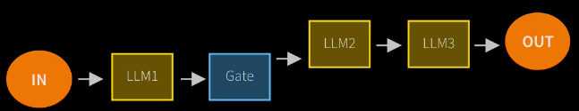
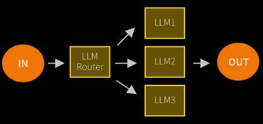
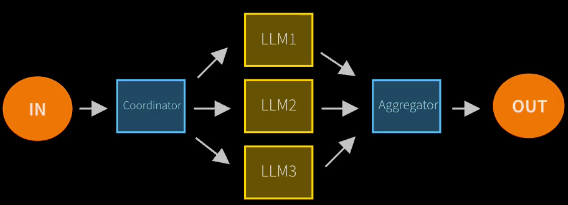
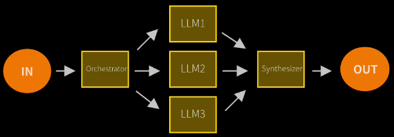
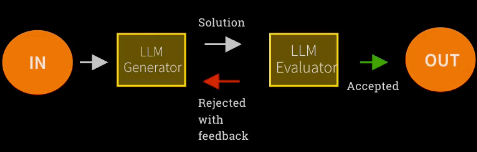
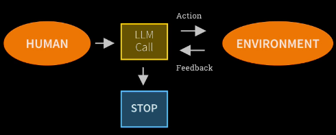

## Agentic systems - 2 Types
Workflows - are systems where LLM's and tools are orchestrated through predefined code paths
Agents - are systems where LLM's dynamically direct their oen processes and tool usage, maintaining control over how they accomplish tasks

### Workflows design patters:
1. Prompt chaining - decompose into fixed sub tasks
   
2. Routing - Direct an input into a specialized sub-task, ensuring separation of concerns  
          
3. Parallelization - Breaking down tasks and running multiple subtasks concurrently
   
4. Orchestrator worker - Complex tasks are broken down dynamically and combined.
   
5. Evaluator-optimizer - LLM output is validated by another
   

### Agents Design pattern:
Are open-ended, have feedback loops and have no fixed path. Hence the output in unpredictable, have no clear path and time limit and may impact costs
    

Risks - Unpredictable path, Unpredictable output, Unpredictable costs
 Mitigations: Monitor (Langsmith), Guardrails ensure agents behave safely, consistently and within intended boundaries

### Agent Tool Design Best Practices
When integrating AI into real-world environments, tool descriptions must be explicit, structured, and informative. By following these principles:

Use descriptive names.
Provide structured metadata.
Leverage JSON Schema for parameters.
Ensure AI has contextual understanding.
Include robust error handling.
Provide informative error messages.
Inject instructions into error messages.

### Agent (GAME Framework) simulation
Before  implementing any agent it is always better to simulate it using chat interfaces. Below prompt format can be used for the same
~~~ 
I'd like to simulate an AI agent that I'm designing. The agent will be built using these components:

Goals: [List your goals]
Actions: [List available actions]

At each step, your output must be an action to take.

Stop and wait and I will type in the result of
the action as my next message.

Ask me for the first task to perform.
~~~
This allows to 
 - understand agent reasoning
 - evolve tools and goals
 - understand memory
 - learning from failures
 - prevent runaway agents (never stopping)
 - rapid iteration and improvement
 - learning from the agent (ask agent itself if anything can be improved)

### Agentic AI frameworks
**Base** - No framework, MCP
 **Level1** - OpenAI agents SDK, Crew AI  
**Level2** - LangGraph, AutoGen

### AI Productivity Tools

## Openai Agent SDK
### Terminology
- Agents - represent LLMs
- Handoffs - represent interactions
- Guardrails - represent controls

Create an instance of agent, use 'with trace()' to track the agent and call 'runner.run()' to run the agent

### Vibe coding tips
- Good vibes - prompt well - ask for short answers and latest APIs
- Vibe but Verify - ask 2 llms the same question and verify
- Step up the vibe - ask to break down the request into smaller testable steps
- Vibe and validate - ask one LLM and get another LLM to check
- Vibe with variety - ask for multiple possible solutions to the same problem

Send email free - http://sendgrid.com

## Crew AI
Offerings 
- CrewAI Enterprise - Multi-agent platform for deploying, running and monitoring Agentic AI
- CrewAI UI Studio - no-code/low-code product for creating multi-agent systems
- Open-source framework - Orchestrate high performing AI agents with ease and scale. Offers crewai crews and crewai flows
Core Concepts
- Agent - an autonomous unit, with an LLM, a role, a goal, a backstory, memory and tools
- Task - a specific assignment to be carried out, with a description, expected output and agent
- Crew - a team of Agents and Tasks;either Sequential or Hierarchical (use a manager LLM to assign)
Configurations
- Agents and Tasks can be created by code setting the backstory, description, expected output etc,
  or each one can be defined in a YAML file and referred in code
- Need to define crew in a class annotated with @CrewBase. Agents annotated with @agent, tasks - @task and finally crew - @crew which brings together agents and tasks
- It uses simple LiteLLM to interface with LLM's with keys set in .env file (Ex - llm = LLM(model="<provider>/<model>"))
- crewai creates a scaffolding folder structure and uses uv
   uv tool install crewai - to install crew
   crewai create crew my_crew or crewai create flow my_flow
- This creates a folder structure as below 
   my_crew
     |-- src
          |-- my_crew
                |-- config
                      |-- agents.yaml
                      |-- tasks.yaml
                |-- crew.py
                |-- main.py
- run with cmd -  crewai run

## Langchain/Langgraph
 
 Terminology
 - Agent workflows are represented as <b><i>graphs</i></b>
 - State represents the current snapshot of the application
 - Nodes are python functions that represent agent logic. They receive current state, perform some action and return updated state
 - Edges are python functions that determine which Node to execute next based on the state. It can be conditional or fixed

The abstraction layers
1. langchain-core: building blocks such as models, messages and tools. Everything can be defined and controlled
2. langgraph: Orchestration layer to manage StateGraph, nodes, edges, checkpoints used to manually control the flow
3. langchain: the agent loop is prebuilt. Just need to supply model, tools and prompt
4. deepagents: Harness layer enabling planning, sub agents, access to file system. Just need to pass the intent.

Middleware allows to add custom logic to the flow as part of create_agent(). Few examples of builtin middleware
functions are PIIMiddleware, SummarizationMiddleware, HumanInTheLoopMiddleware

## Autogen

Autogen AgentChat - 
Core building blocks: Models, Messages, Agents, Teams

Autogen Core - 
 - An agent interaction framework agnostic to agent abstraction with focus on managing interactions (creation and communication)
between distributed and diverse agents.
 - Provides a runtime environment, which facilitates communication between agents, manages their identities and lifecycles, and enforce security and privacy boundaries.
 - Supports 2 types of communication infrastructure called runtimes - standalone and distributed
 - Agent ID uniquely identifies an agent instance within an agent runtime – including distributed runtime. 
   It is the “address” of the agent instance for receiving messages. It has two components: agent type and agent key.
 - A distributed runtime consists of a 
     - 'worker runtime' that advertises agents to the host service and handles executing their code and 
     - 'host service' connected to worker runtimes, handling message delivery and sessions for direct messages 

## ADK (Agent Development Kit) and A2A
- Code first (Agents and tools in python or java)
- A typed function is a tool
- adk web - local trace playground
- MCP and A2A - Protocols for communications with tools and agents

## Strands

## Pydantic AI

## MS Agent Framework

## Agno

## Mastra

## MCP
- MCP involves three core components
   - Host is the LLM app like Claude or the agentic solution
   - MCP Client lives inside Host and connects 1:1 with MCP server
   - MCP Server provides tools, context and prompts for use by host 
- Architecture -
   
- MCP Servers most often run on local computer. 
- MCP supports two Transport mechanisms
   - Stdio spawns a process and communicates via standard input/output
      
   - Streamable HTTP uses HTTP POST and GET requests
- MCP Marketplaces
  - https://mcp.so
  - https://glama.ai/mcp
  - https://smithery.ai
  - for more check here - https://huggingface.co/blog/LLMhacker/top-11-essential-mcp-libraries
- Reference blog on MCP - https://huggingface.co/blog/Kseniase/mcp
- Why make an MCP Server
  - Allow others to incorporate tools and resources
  - Consistently incorporate all MCP servers
  - Understand the plumbing
- Is it's only for internal specific use, use @tool/@function_tool instead
